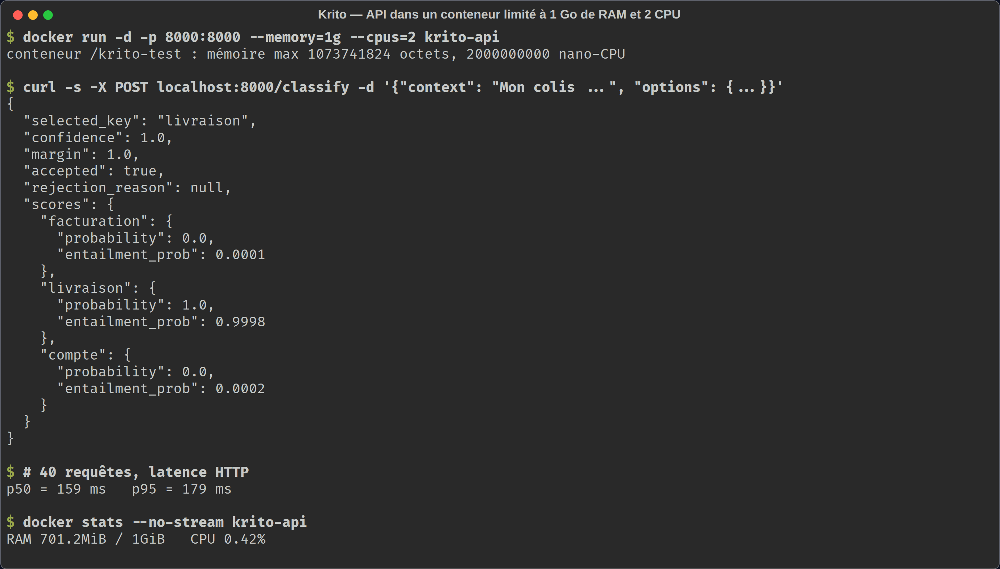

# Krito

**L'IA de décision qui tourne sur un simple CPU.** Krito choisit parmi *vos* options, avec une confiance chiffrée, directement sur vos serveurs : pas de GPU, pas d'API externe, pas de données qui sortent.

| 95 % | 88 % | 404 Mo | 710 Mo | 0 |
|:-:|:-:|:-:|:-:|:-:|
| précision moyenne sur 12 domaines en français | sur un domaine jamais vu à l'entraînement | de modèle (ONNX int8) | de RAM au maximum | GPU nécessaire |



Krito s'inspire de l'idée des modèles « System One » popularisée par [Jev de TypeSafe](https://typesafe.ai/blog/introducing-system-one-models-and-jev) : des réponses typées et une confiance chiffrée plutôt que du texte libre. Il vise une IA **souveraine et sobre** : déployable facilement en entreprise, sur le matériel existant, avec peu de mémoire. Il est publié par [POLYMORFIS](https://www.polymorfis.com/), sous licence MIT. Le code, les données, les expériences et les résultats sont **tous** dans ce dépôt.

> **Statut : prototype (v0.2).** Les chiffres viennent de données synthétiques : lisez les [limites](docs/performances.md#limites-des-mesures) avant tout usage en production.

## Documentation

| | |
|---|---|
| [Guide utilisateur](docs/guide-utilisateur.md) | Installation, première décision, bien écrire ses options, garde-fous, calibration. |
| [Manuel d'intégration](docs/integration.md) | Bibliothèque, API Docker, Kubernetes, serverless, dimensionnement, sécurité. |
| [Architecture](docs/architecture.md) | Fonctionnement interne et diagrammes. |
| [Entraîner et exporter](docs/entrainement.md) | Fine-tuning sur vos données, export ONNX pour CPU. |
| [Performances](docs/performances.md) | Tous les chiffres mesurés, leur méthode et leurs limites. |
| [FAQ](docs/faq.md) | Questions fréquentes. |
| [Exemples](examples/README.md) | 6 scripts exécutables, une image Docker, une fonction Lambda. |
| [Landing page](site/index.html) | Page de présentation, publiée par GitHub Pages. |

---

## Principe

Krito repose sur un modèle d'**inférence en langage naturel** (NLI) de type *cross-encoder*. Pour chaque option, le modèle évalue la paire `(contexte, hypothèse)` et produit trois logits : *entailment* (implication), *contradiction* et *neutral*. L'hypothèse est la description de l'option, éventuellement placée dans un gabarit (« Ce message concerne {}. »).

```
            ┌──────────────────────────┐
contexte ──►│                          │── logits (E, C, N) option A ─┐
hypo. A  ──►│  Cross-encoder NLI       │── logits (E, C, N) option B ─┼─► score = E − C ─► softmax entre options
hypo. B  ──►│  (PyTorch ou ONNX)       │── logits (E, C, N) option C ─┘                     │
hypo. C  ──►│                          │                                                     ▼
            └──────────────────────────┘                          option retenue, confiance, marge
                                                                                               │
                                     softmax(E, C, N) de l'option retenue ─► P(entailment) ───┤
                                                                                               ▼
                                                        garde-fous : threshold, min_margin, min_entailment
```

1. **Score de décision** : `entailment − contradiction` pour chaque option.
2. **Confiance relative** : softmax des scores entre les options, avec une température réglable. **Marge** : écart avec la deuxième option.
3. **Implication absolue** : probabilité que le contexte implique l'option, indépendamment des autres options.
4. **Garde-fous** : la décision est rejetée si l'un des seuils fournis n'est pas atteint.

## Installation

Prérequis : Python ≥ 3.11 et [uv](https://docs.astral.sh/uv/).

| Usage | Commande | Poids des dépendances |
|---|---|---|
| Production / serverless, CPU (ONNX Runtime) | `pip install "krito[onnx] @ git+https://github.com/polymorfis/krito"` | environ **154 Mo** |
| Développement (PyTorch, GPU possible) | `pip install "krito[torch] @ git+https://github.com/polymorfis/krito"` | environ 5,6 Go avec CUDA |
| Travailler sur le projet | `git clone … && uv sync --all-groups` | tout |

Une fois Krito publié sur PyPI, `pip install "krito[onnx]"` suffira.

## Utilisation

### Avec PyTorch

```python
from krito import KritoEngine

engine = KritoEngine(hypothesis_template="Ce message concerne {}.")  # GPU utilisé s'il est disponible

result = engine.classify(
    "Le colis indiqué comme livré n'est jamais arrivé.",
    {
        "billing":  "un problème de facturation ou de paiement",
        "shipping": "la livraison ou le suivi d'un colis",
        "account":  "la connexion ou l'accès au compte",
    },
    min_entailment=0.5,
)

if result.accepted:
    print(result.selected_key, f"{result.confidence:.0%}")
else:
    print("Décision rejetée :", result.rejection_reason)  # à router vers un humain
```

Le modèle par défaut, [`mDeBERTa-v3-base-xnli-multilingual-nli-2mil7`](https://huggingface.co/MoritzLaurer/mDeBERTa-v3-base-xnli-multilingual-nli-2mil7), est multilingue. Il est téléchargé au premier lancement.

### Avec ONNX Runtime (sans PyTorch)

```python
from krito import KritoEngine

engine = KritoEngine.from_onnx("chemin/vers/modele", threads=2,
                               hypothesis_template="Ce message concerne {}.")
```

Le dossier doit contenir `model.int8.onnx` (ou `model.onnx`), `tokenizer.json` et `labels.json`. [experiments/export_onnx.py](experiments/export_onnx.py) produit un tel dossier à partir d'un modèle fine-tuné.

### En ligne de commande

```bash
uv run krito
```

### API

#### `KritoEngine(model_name=DEFAULT_MODEL, device=None, *, backend=None, hypothesis_template="{}")`

| Paramètre             | Description                                                                  |
|-----------------------|------------------------------------------------------------------------------|
| `model_name`          | Tout cross-encoder NLI **à 3 classes** du Hugging Face Hub (backend PyTorch). |
| `device`              | `"cuda"`, `"cpu"`… Par défaut : `cuda` si disponible.                         |
| `backend`             | Backend déjà construit (`CrossEncoderBackend`, `OnnxBackend` ou le vôtre).    |
| `hypothesis_template` | Gabarit appliqué à chaque description d'option ; doit contenir `{}`.         |

`KritoEngine.from_onnx(model_dir, *, threads=None, **kwargs)` construit un moteur ONNX.

#### `engine.classify(context, options, *, threshold=None, min_margin=None, min_entailment=None, temperature=1.0)`

| Paramètre        | Description                                                                          |
|------------------|--------------------------------------------------------------------------------------|
| `context`        | Texte à analyser (chaîne non vide).                                                  |
| `options`        | `dict[str, str]` : clé → description en langage naturel. Au moins 2 options.         |
| `threshold`      | Confiance relative minimale.                                                         |
| `min_margin`     | Écart minimal entre la 1re et la 2e option.                                          |
| `min_entailment` | Probabilité d'implication absolue minimale de l'option retenue (rejette les hors-sujet). |
| `temperature`    | `> 1` aplatit la distribution entre options, `< 1` l'accentue.                        |

Renvoie un `DecisionResult` immuable :

| Champ              | Type                     | Description                                                   |
|--------------------|--------------------------|---------------------------------------------------------------|
| `selected_key`     | `str`                    | Clé de l'option retenue.                                      |
| `selected_label`   | `str`                    | Description de l'option retenue.                              |
| `confidence`       | `float`                  | Probabilité relative de l'option retenue.                     |
| `margin`           | `float`                  | Écart de probabilité avec la deuxième option.                 |
| `accepted`         | `bool`                   | `True` si tous les garde-fous sont satisfaits.                |
| `rejection_reason` | `str \| None`            | Motif(s) de rejet, séparés par ` \| `.                        |
| `scores`           | `dict[str, OptionScore]` | Par option : logits E/C/N, score de décision, `probability`, `entailment_prob`. |

Un contexte trop long pour le modèle est tronqué avec un avertissement (`UserWarning`).

## Bonnes pratiques

- **Utilisez un gabarit d'hypothèse** (`hypothesis_template="Ce message concerne {}."`) et des descriptions précises plutôt que des étiquettes d'un mot.
- **Utilisez `min_entailment` pour rejeter les hors-sujet.** La confiance relative reste élevée même quand aucune option ne convient.
- **Fixez les seuils sur vos propres données**, à partir d'un jeu de validation annoté.
- **Fine-tunez sur votre domaine** si vous avez des données : c'est le levier le plus puissant (voir ci-dessous).

## Résultats des études

Deux rapports détaillés :
- [experiments/RESULTS.md](experiments/RESULTS.md) : un domaine (support client). Comparaison du fine-tuning, de scikit-learn, de SetFit, d'un juge de confiance, de la prédiction conforme, d'un LLM et de l'export ONNX.
- [experiments/RESULTS_MULTIDOMAIN.md](experiments/RESULTS_MULTIDOMAIN.md) : **12 domaines** (juridique, programmation, finance, marketing, auto, communication, actualités, politiques publiques, santé administrative, immobilier, support informatique, avis e-commerce). 4 053 textes d'entraînement générés par `gemma4:26b` et contrôlés par `qwen3.8:27b`, testés sur des textes d'un autre auteur.

Précision moyenne sur les 12 domaines :

| Approche | Options libres | Domaine jamais vu | Domaine vu à l'entraînement | Latence |
|---|:-:|:-:|:-:|:-:|
| Krito v0.1 (`nli-deberta-v3-xsmall`) | oui | ~30 % ¹ | — | 74 ms CPU |
| Défaut v0.2 (`mDeBERTa` multilingue, zero-shot) | oui | 58 % | — | ~0,2–1,3 s CPU |
| Fine-tuné sur le support seul | oui | 79 % | 94 % ¹ | ~0,23 s CPU |
| **Fine-tuné sur 12 domaines (`krito-nli-fr-multi`, ONNX int8)** | oui | **88 %** ² | **95 %** | ~0,23 s CPU |
| `e5-base` + régression logistique | non | — | 94 % | — |
| LLM local 27B (référence haute) | oui | — | 97 % | 3,8 s GPU |

¹ Mesuré sur le seul domaine support (étude 1). ² Évaluation « un domaine exclu » : entraîné sur 11 domaines, testé sur le 12e.

En serverless avec `krito[onnx]` et le modèle int8 : 154 Mo de dépendances, 425 Mo de modèle, démarrage à froid d'environ 3 s, 0,9 Go de RAM.

> Toutes les données des études sont écrites par des LLM : les chiffres absolus sont probablement optimistes, les comparaisons restent valables. Validez sur vos propres données.

Les modèles fine-tunés ne sont pas encore publiés. Pour les reproduire :

```bash
uv sync --all-groups
cd experiments
uv run python run_multidomain.py && uv run python export_onnx.py --model multi   # 12 domaines
uv run python export_onnx.py --model mdeberta                                    # support seul
```

## Tests

```bash
uv run pytest                      # tous les tests
uv run pytest -m "not integration" # tests unitaires (rapides, sans modèle)
uv run pytest -m integration       # tests avec les vrais modèles (PyTorch et, s'il existe, ONNX)
```

## Limites connues

| Limite | Impact | Piste |
|--------|--------|-------|
| Les modèles fine-tunés ne sont pas publiés et ont été entraînés sur des données synthétiques. | Le défaut reste le modèle zero-shot, moins précis en français (58 à 59 %). | Annoter de vrais tickets, puis publier le modèle sur le Hugging Face Hub. |
| La confiance n'est pas calibrée sur vos données. | Des erreurs à forte confiance restent possibles. | Fixer les seuils sur un jeu de validation ; ajouter un juge appris (voir l'étude). |
| L'échelle de `entailment_prob` dépend du modèle et du gabarit. | Un même seuil `min_entailment` n'a pas le même effet d'un modèle à l'autre. | Calibrer le seuil sur de vraies données annotées, par modèle. |
| Le zero-shot reste faible sur les domaines à jargon. | Programmation jamais vue : 67 %. | Ajouter des données du domaine (88 % une fois inclus). |
| Une seule primitive (choix unique). | Pas d'équivalent aux questions oui/non ni aux échelles de Jev. | À ajouter. |
| Pas de traitement par lots de plusieurs contextes. | Débit limité à un contexte par appel. | API `classify_batch`. |
| L'int8 n'a pas été mesuré sur un CPU récent. | Gain de vitesse inconnu (nul sur un CPU sans VNNI). | Mesurer sur la cible serverless. |
| Modèle et dépendances ONNX : environ 580 Mo. | Trop gros pour une archive AWS Lambda classique (250 Mo). | Image conteneur, ou modèle sur stockage attaché. |

## Feuille de route

- [x] Garde-fou absolu (`min_entailment`)
- [x] Modèle multilingue par défaut
- [x] Gabarit d'hypothèse intégré (`hypothesis_template`)
- [x] Backend ONNX Runtime sans PyTorch
- [x] Étude comparative : fine-tuning, scikit-learn, SetFit, juge, prédiction conforme, LLM
- [x] Étude multi-domaines (12 domaines, évaluation « un domaine exclu »)
- [ ] Calibration du seuil `min_entailment` sur des exemples annotés
- [ ] Données réelles annotées et publication du modèle fine-tuné
- [ ] Mode supervisé `KritoClassifier.fit(exemples)` pour les taxonomies fixes
- [ ] Juge de confiance optionnel
- [ ] Primitives oui/non et échelle ordonnée
- [ ] Traitement par lots

## Licence

Distribué sous licence [MIT](LICENSE).
