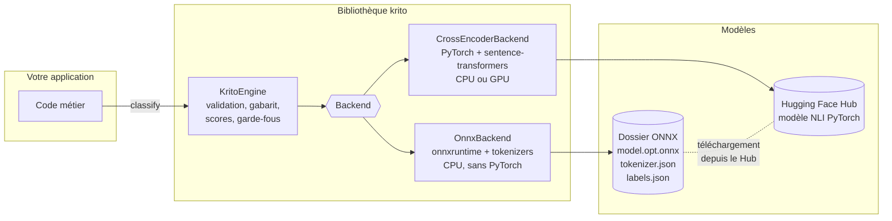
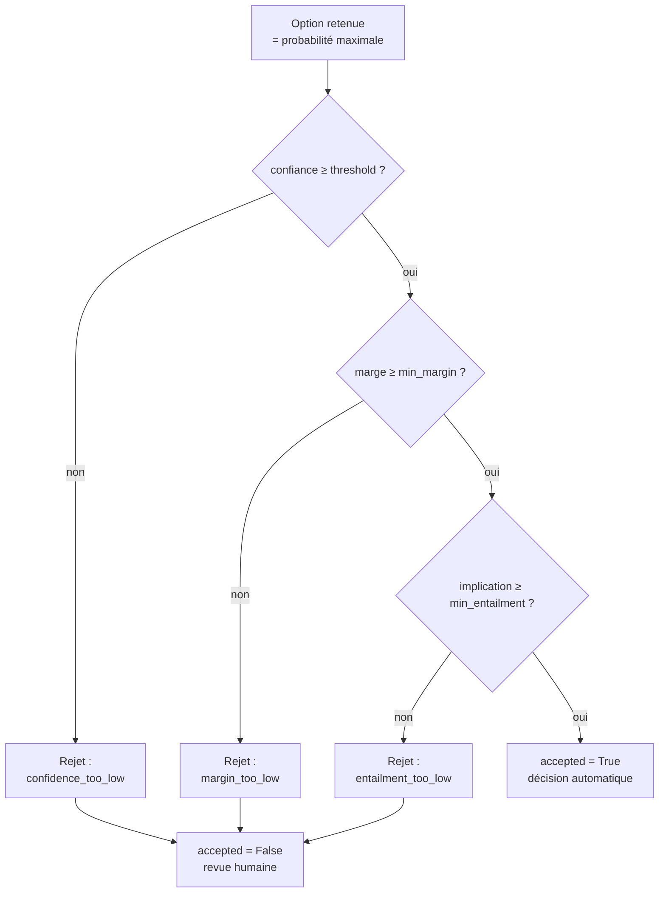
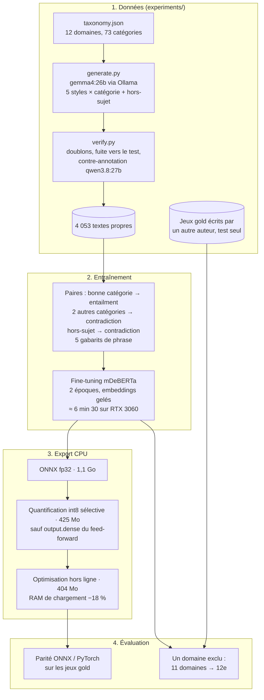
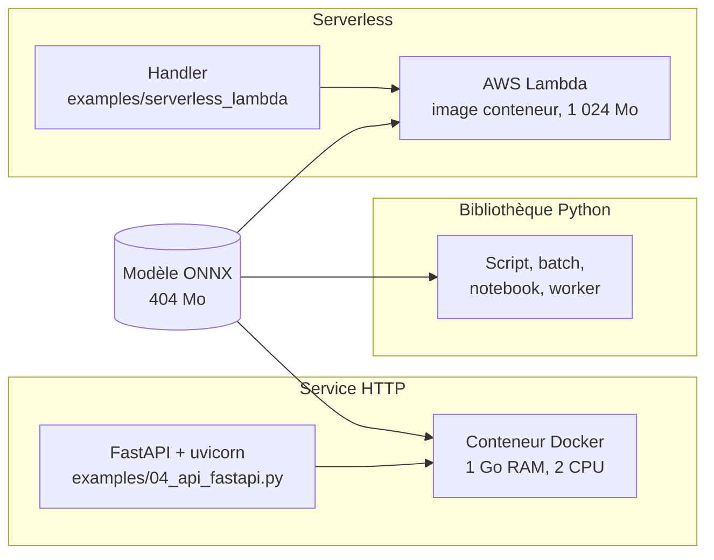

# Architecture

Ce document décrit comment Krito fonctionne à l'intérieur : le principe de décision, les composants, le déroulé d'un appel, la chaîne de fabrication des modèles et les modes de déploiement. Les diagrammes sont en Mermaid et s'affichent directement sur GitHub.

## 1. Principe : une décision par inférence en langage naturel

Krito ne *génère* pas de texte. Il pose au modèle une série de questions fermées : « ce texte implique-t-il que *[option]* ? ».

Un modèle d'**inférence en langage naturel** (NLI) de type *cross-encoder* lit chaque paire (texte, hypothèse) en entier et produit trois scores :

- ***entailment*** (E) : le texte implique l'hypothèse ;
- ***contradiction*** (C) : le texte la contredit ;
- ***neutral*** (N) : ni l'un ni l'autre.

L'hypothèse est la description de l'option placée dans un gabarit, par exemple « Ce texte concerne *la livraison d'un colis*. ».

Conséquences directes de ce choix :

- **Aucune hallucination de format** : la réponse est toujours l'une des clés fournies.
- **Des options libres à chaque appel** : ajouter une catégorie ne demande aucun réentraînement.
- **Un coût linéaire** : une paire est évaluée par option, donc 6 options coûtent environ deux fois plus que 3.
- **Un petit modèle suffit** : environ 280 millions de paramètres, 404 Mo en int8, exécutable sur CPU.

## 2. Composants



| Composant | Rôle | Dépendances |
|---|---|---|
| `KritoEngine` | API publique : validation des entrées, application du gabarit, calcul des scores, garde-fous, résultat typé. | `numpy` |
| `OnnxBackend` | Inférence ONNX Runtime sur CPU. Choisit le meilleur fichier disponible (`model.opt.onnx` > `model.int8.onnx` > `model.onnx`) et avertit en cas de troncature. | `onnxruntime`, `tokenizers`, `huggingface-hub` (extra `krito[onnx]`, environ 154 Mo) |
| `CrossEncoderBackend` | Inférence PyTorch, utile en développement, sur GPU ou pour tester un modèle du Hub. | `torch`, `transformers`, `sentence-transformers` (extra `krito[torch]`, plusieurs Go) |
| `Backend` (protocole) | Interface d'un backend : `logits(pairs) -> ndarray[n, 3]` au format (E, C, N). Vous pouvez fournir le vôtre. | — |

Le cœur (`KritoEngine`) ne dépend que de `numpy`. Tout le reste est interchangeable.

## 3. Déroulé d'un appel `classify`

```mermaid
sequenceDiagram
    autonumber
    participant App as Application
    participant K as KritoEngine
    participant B as Backend (ONNX)
    App->>K: classify(texte, options, garde-fous)
    K->>K: validation (texte non vide, ≥ 2 options, descriptions non vides)
    K->>K: hypothèses = gabarit.format(description) pour chaque option
    K->>B: logits([(texte, hypothèse_1), …, (texte, hypothèse_n)])
    B->>B: tokenisation (+ avertissement si > 512 tokens)
    B->>B: inférence ONNX Runtime (un lot de n paires)
    B-->>K: logits [n × 3] ordonnés (E, C, N)
    K->>K: score = E − C ; probabilités = softmax(score / température)
    K->>K: implication absolue = softmax(E, C, N)[E] par option
    K->>K: garde-fous : threshold, min_margin, min_entailment
    K-->>App: DecisionResult (clé, confiance, marge, accepted, motif, scores)
```

### Les calculs

Pour chaque option *i*, à partir des logits (Eᵢ, Cᵢ, Nᵢ) :

| Grandeur | Formule | Sens |
|---|---|---|
| Score de décision | sᵢ = Eᵢ − Cᵢ | Force de l'implication face à la contradiction. |
| Probabilité (relative) | pᵢ = softmax(s / T)ᵢ | Part de l'option *face aux autres options*. La somme vaut 1. |
| Confiance | max pᵢ | Probabilité de l'option retenue. |
| Marge | p₍₁₎ − p₍₂₎ | Écart entre la première et la deuxième option. |
| Implication absolue | softmax(Eᵢ, Cᵢ, Nᵢ)[E] | Probabilité que le texte implique l'option, **indépendamment des autres**. |

La distinction entre **relatif** et **absolu** est essentielle. Si aucune option ne convient, la moins mauvaise obtient quand même une forte probabilité relative. Seule l'implication absolue baisse alors, ce qui permet de rejeter un message hors-sujet.

### Les garde-fous



Tous les garde-fous sont optionnels et évalués ensemble : `rejection_reason` liste **tous** les motifs, séparés par ` | `. Seuls les seuils fournis sont testés.

## 4. Fabrication des modèles

Les modèles fine-tunés de Krito partent d'un NLI multilingue public, `mDeBERTa-v3-base-xnli-multilingual-nli-2mil7` (licence MIT). Ils sont spécialisés en français sur des données générées puis contrôlées par des LLM locaux.



Détails et chiffres : [performances.md](performances.md) et [entrainement.md](entrainement.md).

### Deux choix techniques non évidents

- **Quantification sélective.** La quantification int8 dynamique par défaut d'ONNX Runtime fait tomber DeBERTa à environ 30 % de précision. Une mesure couche par couche montre que la sortie du bloc *feed-forward* (`output.dense`, valeurs d'activation extrêmes après GELU) ne supporte pas l'int8. Les MatMul entre deux activations (attention) ne doivent pas l'être non plus. Krito quantifie tout le reste, y compris la table d'embeddings (250 000 tokens × 768), qui représente l'essentiel du poids.
- **Optimisation hors ligne.** ONNX Runtime optimise le graphe à chaque chargement, ce qui crée des copies temporaires des poids. En enregistrant une fois pour toutes le graphe optimisé (niveau *basic*, indépendant du matériel), le pic de RAM passe de 869 à 710 Mo, avec une latence et des prédictions identiques.

## 5. Déploiement



| Mode | Quand l'utiliser | Mesuré |
|---|---|---|
| Bibliothèque | Traitements par lots, intégration dans une application Python existante. | 154 à 448 ms par décision (4 à 1 thread, 6 options), 710 Mo de RAM. |
| API Docker | Service partagé dans le SI, appelé depuis n'importe quel langage. | Prête en 2,9 s ; environ 700 Mo sous une limite de 1 Go ; 278 ms par requête (6 options, 2 CPU). |
| Lambda / FaaS | Trafic irrégulier, paiement à l'usage. | Démarrage à froid 1,8 s ; 167 ms à chaud (3 options) ; 655 Mo. |

Toutes les mesures proviennent d'un Intel i7-4770K de 2013 : un serveur actuel fera mieux. Voir [integration.md](integration.md) pour la mise en œuvre.

## 6. Organisation du dépôt

```
krito/
├── src/krito/            bibliothèque (KritoEngine, backends)
├── tests/                tests unitaires (faux backend) et d'intégration (vrais modèles)
├── examples/             exemples exécutables, Docker, Lambda
├── docs/                 cette documentation
├── experiments/          données, scripts d'étude, rapports et résultats
│   ├── data/             taxonomie, textes générés et vérifiés, jeux gold
│   ├── results/          métriques brutes (JSON) et tableaux
│   └── models/           modèles produits (non versionnés, voir entrainement.md)
├── benchmarks/           premier benchmark (v0.1)
└── site/                 landing page et captures d'écran reproductibles
```
