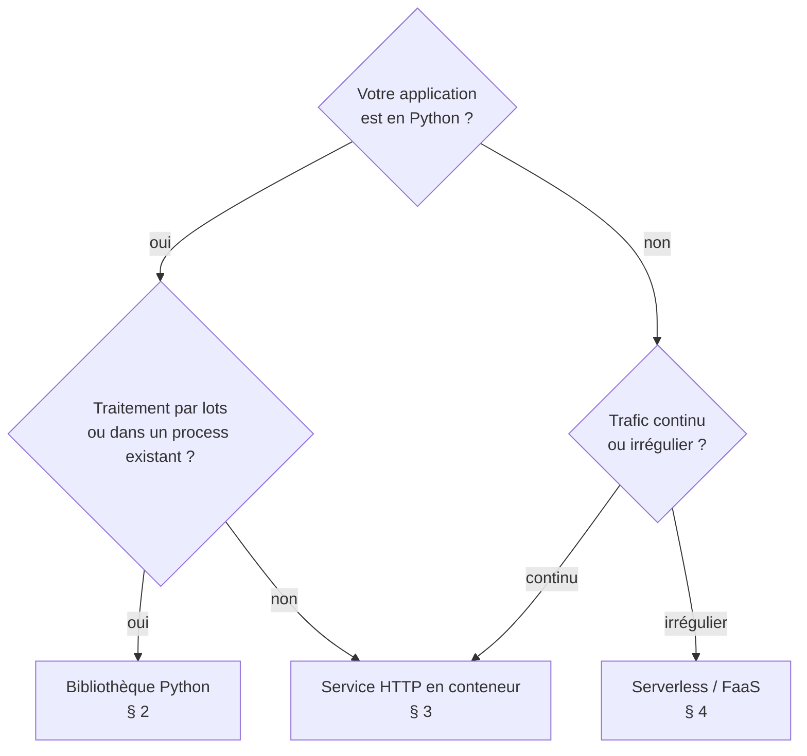

# Manuel d'intégration

Ce manuel s'adresse aux équipes qui intègrent Krito dans un système d'information : développeurs, DevOps, architectes. Il couvre les trois modes de déploiement, le dimensionnement, la sécurité et l'exploitation. Tous les exemples cités sont dans [examples/](../examples/) et ont été exécutés.

## 1. Choisir un mode d'intégration



| Mode | Avantages | Points d'attention |
|---|---|---|
| Bibliothèque | Aucune infrastructure en plus ; latence minimale. | Chaque processus charge son propre modèle (environ 710 Mo). |
| Service HTTP | Appelable depuis tout langage ; un seul modèle en mémoire par conteneur. | Un service à exploiter (supervision, mise à l'échelle). |
| Serverless | Paiement à l'usage ; zéro serveur à gérer. | Démarrage à froid (environ 1,8 s) ; image conteneur obligatoire sur AWS Lambda. |

## 2. Bibliothèque Python

```python
from krito import KritoEngine

# À créer UNE fois au démarrage du processus, puis à réutiliser.
ENGINE = KritoEngine.from_onnx("/opt/krito/model", threads=2,
                               hypothesis_template="Ce texte concerne {}.")

def router(message: str) -> str | None:
    r = ENGINE.classify(message, SERVICES, min_entailment=0.5, min_margin=0.2)
    return r.selected_key if r.accepted else None   # None -> revue humaine
```

Bonnes pratiques :

- **Un seul moteur par processus.** Le chargement coûte environ 2 s et 710 Mo ; les appels suivants ne coûtent que l'inférence.
- **Le moteur est sûr en multithread.** Un même `KritoEngine` peut être appelé depuis plusieurs threads (testé avec 8 threads concurrents : résultats identiques au séquentiel).
- **`threads`** fixe le nombre de cœurs utilisés **par appel**. Sur un serveur qui traite beaucoup de requêtes en parallèle, préférez plusieurs processus avec `threads=1` ou `2`, plutôt qu'un seul processus avec beaucoup de threads.
- **Traitement par lots** : voir [05_traitement_csv.py](../examples/05_traitement_csv.py). Environ 180 ms par message avec 6 options et 4 threads.

### Écrire son propre backend

Tout objet qui implémente `logits(pairs) -> numpy.ndarray` de forme `[n, 3]`, dans l'ordre (entailment, contradiction, neutral), peut servir de backend : un autre runtime, un serveur d'inférence distant, un accélérateur…

```python
class MonBackend:
    def logits(self, pairs):          # pairs : liste de (texte, hypothèse)
        ...                           # -> np.ndarray [len(pairs), 3] (E, C, N)

engine = KritoEngine(backend=MonBackend(), hypothesis_template="Ce texte concerne {}.")
```

## 3. Service HTTP en conteneur

[04_api_fastapi.py](../examples/04_api_fastapi.py) expose deux routes :

| Route | Rôle |
|---|---|
| `POST /classify` | Décision : `context`, `options`, et optionnellement `threshold`, `min_margin`, `min_entailment`. |
| `GET /health` | Sonde de vie pour l'orchestrateur. |

La documentation OpenAPI interactive est servie sur `/docs`.

### Image Docker

```bash
hf download polymorfis/krito-nli-fr-multi --local-dir modele      # ou copiez un export local
docker build -f examples/docker_api/Dockerfile -t krito-api .
docker run -d -p 8000:8000 --memory=1g --cpus=2 krito-api
```

L'image ([Dockerfile](../examples/docker_api/Dockerfile)) part de `python:3.12-slim`. Elle n'installe que `krito[onnx]`, FastAPI et uvicorn, s'exécute avec un utilisateur non privilégié et déclare un `HEALTHCHECK`. Taille : 735 Mo, modèle compris.

**Mesuré avec `--memory=1g --cpus=2`** sur un i7-4770K :

| Mesure | Valeur |
|---|---|
| Prête à répondre | 2,9 s après le lancement |
| RAM au repos / après 41 requêtes | 651 Mio / 701 Mio (limite 1 Gio, aucun arrêt pour manque de mémoire) |
| Latence HTTP, 6 options | p50 278 ms, p95 286 ms |
| Latence HTTP, 3 options | p50 160 ms, p95 167 ms |

### Kubernetes

```yaml
apiVersion: apps/v1
kind: Deployment
metadata: { name: krito }
spec:
  replicas: 2
  selector: { matchLabels: { app: krito } }
  template:
    metadata: { labels: { app: krito } }
    spec:
      containers:
        - name: krito
          image: registre.interne/krito-api:0.2.0
          ports: [{ containerPort: 8000 }]
          env: [{ name: KRITO_THREADS, value: "2" }]
          resources:
            requests: { cpu: "2", memory: "800Mi" }
            limits:   { cpu: "2", memory: "1Gi" }
          readinessProbe: { httpGet: { path: /health, port: 8000 }, initialDelaySeconds: 3 }
          livenessProbe:  { httpGet: { path: /health, port: 8000 }, periodSeconds: 30 }
```

Mettez à l'échelle **horizontalement** (plus de réplicas) : chaque réplica traite environ 3 à 6 décisions par seconde avec 2 CPU, selon le nombre d'options.

### Variables d'environnement

| Variable | Défaut | Rôle |
|---|---|---|
| `KRITO_MODEL` | `/opt/krito/model` dans les images | Dossier du modèle ONNX, ou identifiant du Hugging Face Hub. |
| `KRITO_THREADS` | `2` | Threads d'inférence par appel. |
| `KRITO_TEMPLATE` | `Ce texte concerne {}.` | Gabarit d'hypothèse. |

## 4. Serverless (AWS Lambda et équivalents)

[serverless_lambda/handler.py](../examples/serverless_lambda/handler.py) accepte un appel direct ou un événement API Gateway (champ `body`). Le moteur est créé au chargement du module : son coût n'est payé qu'au démarrage à froid.

Le modèle et les dépendances (environ 560 Mo) dépassent la limite de 250 Mo d'une archive zip Lambda : utilisez une **image conteneur** (limite de 10 Go).

```bash
docker build -f examples/serverless_lambda/Dockerfile -t krito-lambda .
# test local avec l'émulateur inclus dans l'image AWS
docker run --rm -p 9000:8080 --memory=1g krito-lambda
curl -s localhost:9000/2015-03-31/functions/function/invocations \
     -d '{"context": "Mon colis est perdu", "options": {"a": "la livraison", "b": "la facturation"}}'
```

**Mesuré dans l'émulateur** (1 Go, 2 CPU, 3 options) : démarrage à froid 1,8 s, invocation à chaud p50 167 ms, 655 Mo de RAM. Sur AWS, allouez **1 024 Mo** : la mémoire allouée détermine aussi la part de CPU. Nous n'avons pas mesuré sur AWS même.

Le même handler s'adapte à d'autres plateformes FaaS : Scaleway Serverless Containers, Google Cloud Run, Azure Container Apps, OpenFaaS, Knative.

## 5. Dimensionnement

| Ressource | Minimum mesuré | Conseillé |
|---|---|---|
| RAM | 710 Mo par processus | 1 Go par processus ou par conteneur |
| CPU | 1 cœur (448 ms par décision, 6 options) | 2 à 4 cœurs par processus |
| Disque | 404 Mo (modèle) + 154 Mo (dépendances) | 1 Go |
| GPU | Aucun | Aucun |

Débit ≈ nombre de processus × (1 / latence). Exemple : 4 conteneurs à 2 CPU, à environ 280 ms par décision, traitent environ 14 décisions par seconde, soit environ 1,2 million par jour.

Le temps de calcul est proportionnel au **nombre d'options** : un routage en deux étapes (4 services puis 3 catégories, soit 7 paires) coûte moins qu'une seule décision parmi 12 catégories.

## 6. Sécurité et conformité

- **Aucune donnée ne sort.** L'inférence est locale, sans appel réseau. Le seul accès réseau possible est le téléchargement initial du modèle depuis le Hugging Face Hub, que vous pouvez supprimer en fournissant un dossier local.
- **Environnements isolés** (sans Internet) : copiez le dossier du modèle et installez les paquets depuis un miroir interne. Krito ne contacte rien d'autre.
- **Journalisation** : Krito ne journalise pas les textes. Si vous le faites, traitez-les comme des données personnelles (RGPD).
- **Surface d'attaque** : les entrées sont du texte brut, validé (non vide) et tronqué à 512 tokens. Limitez la taille des requêtes au niveau de votre API.
- **Supervision humaine** : les garde-fous permettent d'envoyer en revue humaine les décisions incertaines. Pour les usages sensibles (RH, santé, juridique), gardez un humain dans la boucle et conservez la trace des décisions (`selected_key`, `confidence`, `rejection_reason`).

## 7. Exploitation

À suivre en production :

| Indicateur | Pourquoi |
|---|---|
| Taux d'acceptation (`accepted`) | Une chute signale un changement dans les messages entrants (nouveau sujet, nouveau canal). |
| Répartition des `rejection_reason` | `entailment_too_low` en hausse : des sujets non couverts par vos options. `margin_too_low` en hausse : des options qui se recouvrent. |
| Taux d'erreur sur un échantillon relu | La seule mesure de qualité réelle. Relisez chaque semaine quelques dizaines de décisions acceptées. |
| Latence p95 | Dimensionnement. |

Recalibrez les seuils ([06_calibration_seuil.py](../examples/06_calibration_seuil.py)) quand vous changez de modèle, de gabarit ou d'options.

## 8. Intégrer depuis d'autres langages

L'API HTTP est le point d'entrée universel.

```javascript
// JavaScript / TypeScript
const r = await fetch("http://krito:8000/classify", {
  method: "POST",
  headers: { "Content-Type": "application/json" },
  body: JSON.stringify({ context: message, options: SERVICES, min_entailment: 0.5 }),
}).then(res => res.json());
if (r.accepted) router(r.selected_key); else revueHumaine(message);
```

```bash
# Shell
curl -s -X POST http://krito:8000/classify -H 'Content-Type: application/json' \
  -d '{"context": "Mon colis est perdu", "options": {"a": "la livraison", "b": "la facturation"}}'
```

```php
// PHP
$r = json_decode(file_get_contents("http://krito:8000/classify", false, stream_context_create(["http" => [
    "method" => "POST", "header" => "Content-Type: application/json",
    "content" => json_encode(["context" => $message, "options" => $services, "min_entailment" => 0.5]),
]])), true);
```
